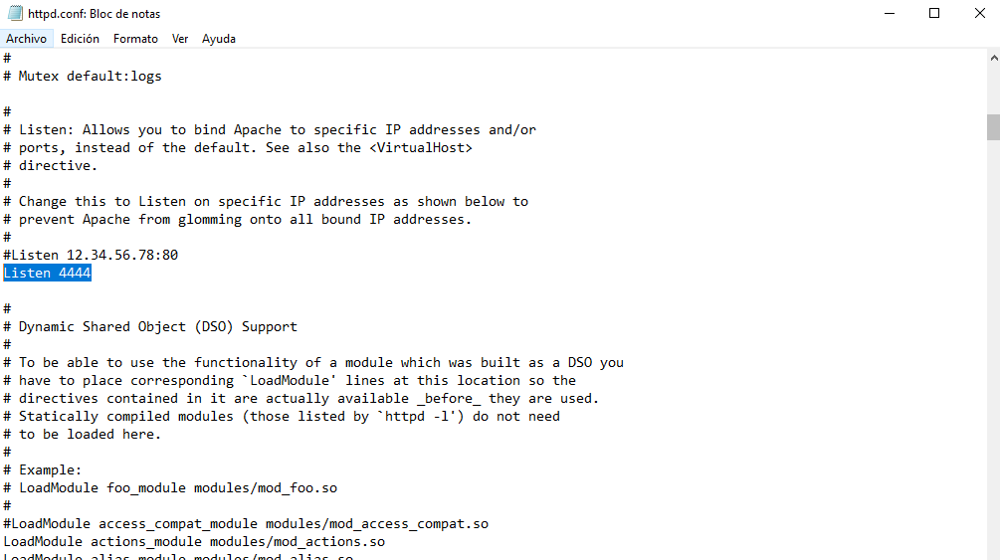
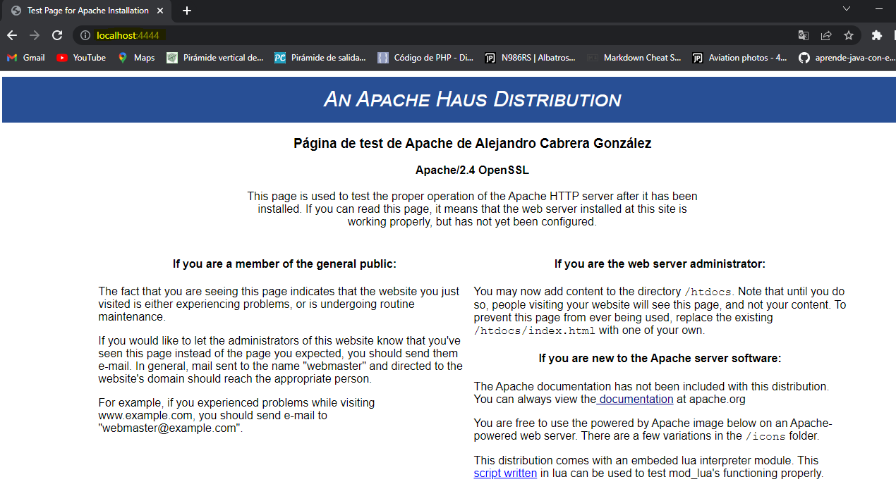

### P2: Administración de servidores web
#### Alejandro Cabrera González
**1. Explique con sus palabras que es una petición GET, POST, PUT y DELETE, remarcando sus diferencias.**
    GET es una petición de recursos o documentos al servidor, que no debe modificar datos del servidor ni la aplicación 
    que lo ejecuta.
    POST es una petición de envío de formularios HTML permitiendo la modificación en el servidor o la aplicación web.
    PUT es una petición para crear o reemplazar un recurso o documento del servidor. Crear una URL nueva a partir del 
    contenido pasado.
    DELETE es una petición que permite eliminar un recurso o documento del servidor.

**2. Cambie del puerto 80 al puerto 4444 el servidor apache2. Muestra desde el navegador
   su funcionamiento adjuntando una captura de pantalla.**

**3. Explica como activar, desactivar, reiniciar y recargar un servidor de Apache2
   explicando la diferencia entre cada uno de los comandos utilizados.**
    
    Para iniciar en linux o windows:
    sudo systemctl start apache2
    Posteriormente.
    sudo service apache2 start
    En lugar de iniciar manualmente el servicio Apache, es una buena idea configurarlo para que se inicie en el arranque del sistema:
    sudo systemctl enable apache2
    apache -n "service name" start

    Para detener Apache:
    sudo systemctl stop apache2 
    o
    sudo service apache2 stop
    apache -n "service name" shutdown

    Para reiniciar hay varias opciones:
    sudo systemctl restart apache2 
    sudo service apache2 restart
    apache -k restart
    Cada vez que realice cambios en su configuración se debe volver a cargar o reiniciar Apache .
    Al recargar, el proceso principal de apache cierra los procesos secundarios, carga la nueva configuración e inicia 
    nuevos procesos secundarios.

    Para volver a cargar Apache:
    sudo systemctl reload apache2 sudo service apache2 reload

   También se puede realizar accediendo a _servicios_ de Windows. Buscar el servicio local Apache y activar, reiniciar o detener el 
   servicio.

**4. ¿Dónde se encuentran los ficheros de configuración de Apache2?**
   Se encuentran en el fichero **httpd.conf** que es el fichero principal de configuración del Apache, y que se 
   encuentra dentro del directorio Conf, 
   en el directorio de instalación del Apache.

**5. ¿Dónde se encuentran los ficheros de ejecución de Apache2?**
   Los ficheros de ejecución se encuentran en la carpeta de Apache llamada bin. 

**6. ¿Dónde se encuentran los ficheros de monitorización de Apache2?**
   En la carpeta **include** se encuentra el fichero _mod_status_ con el que podemos monitorizar gran cantidad de información 
   como: requests, VirtualHosts, recurso servido, workers, IPs, nº de hilos y procesos de servidor, uso de RAM y de CPU.
**7. ¿Qué es un Firewall? ¿Para qué funciona? ¿Por qué es necesario?**
   Un firewall es un dispositivo de seguridad de la red que monitoriza el tráfico entrante y saliente y decide si debe 
   permitir o bloquear un tráfico específico en función de un conjunto de restricciones de seguridad ya definidas.
   Son necesarios porque hacen de barrera entre las redes internas seguras, controladas y fiables y las redes externas 
  poco fiables como Internet.

**8. Explica con tus palabras las diferentes partes de una URL.**
    Las diferentes partes de una URL son el protocolo, el host, el puerto, la ruta, la query y el fragmento.
   •El protocolo: Indica el protocolo que se utilizará para acceder al recurso (HTTP o HTTPS).
   •El host: Identifica el servidor. Puede ser un DNS o IP.
   •El puerto: Indica que puerto TCP/IP se utilizará para acceder al recurso.
   •La ruta: Localización del recurso en el servidor.
   •La query: Permite pasar parámetros adicionales.
   •El fragmento: Especifica una sección específica del recurso. No se envía por petición.

**9. Explica el funcionamiento del protocolo HTTP.**
   El navegador envía la petición HTTP, al servidor web que administre el dominio en concreto.
   El servidor web recibe la solicitud HTTP, busca el archivo en cuestión que suele ser el archivo index.html y envía en 
   primer lugar una cabecera o header. La cabecera le comunica al cliente, mediante un código de estado, el resultado de 
   la búsqueda. 
   Si se ha encontrado el archivo solicitado y el cliente ha solicitado recibirlo, el servidor 
   envía, tras el header, el _message bodyo_ cuerpo del mensaje, el contenido solicitado: el archivo index.html.
   El navegador recibe el archivo y lo abre en forma de página web.